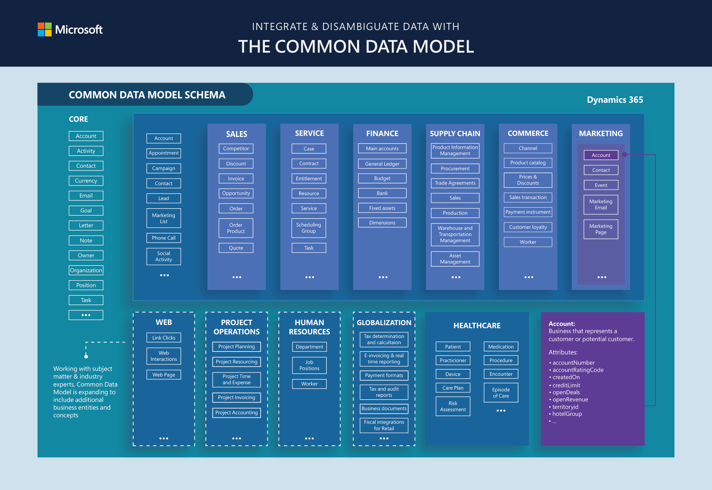

# PL-400-Guide

## Collection and Exam
- [PL-400 OFFICIAL COLLECTION](https://learn.microsoft.com/en-us/users/msftofficialcurriculum-4292/collections/zwm5c41m26jp0q)
- [Exam PL-400: Microsoft Power Platform Developer](https://learn.microsoft.com/en-us/certifications/exams/pl-400)

## Links of interest
- [Microsoft Power Platform: 2022 release wave 2 plan](https://learn.microsoft.com/en-gb/power-platform-release-plan/2022wave2/)
- [Overview of industry accelerators](https://learn.microsoft.com/es-es/dynamics365/industry/accelerators/overview?azureportal=true)
- [Connector reference overview](https://learn.microsoft.com/en-us/connectors/connector-reference/)
- [License requirements for tables](https://learn.microsoft.com/en-us/power-apps/maker/data-platform/data-platform-entity-licenses)
- [Define rollup columns that aggregate values](https://learn.microsoft.com/en-us/power-apps/maker/data-platform/define-rollup-fields)
- [Configure user security to resources in an environment](https://learn.microsoft.com/en-us/power-platform/admin/database-security)
- [Type of model-driven app forms in Power Apps](https://learn.microsoft.com/en-us/power-apps/maker/model-driven-apps/types-forms)
- [List of all Power Apps connectors](https://learn.microsoft.com/en-us/connectors/connector-reference/connector-reference-powerapps-connectors)
- [Power Fx formula reference for Power Apps](https://learn.microsoft.com/en-us/power-platform/power-fx/formula-reference)
- [Canvas component overview](https://learn.microsoft.com/en-us/power-apps/maker/canvas-apps/create-component)
- [Tenant-to-tenant migration](https://learn.microsoft.com/en-us/power-platform/admin/move-environment-tenant?tabs=image)
- [Geo to geo migrations](https://learn.microsoft.com/en-us/power-platform/admin/geo-to-geo-migrations)
- [ForAll function in Power Apps](https://learn.microsoft.com/en-us/power-platform/power-fx/reference/function-forall)
- [Azure Functions documentation](https://learn.microsoft.com/en-us/azure/azure-functions/)
- [App Service overview](https://learn.microsoft.com/en-us/azure/app-service/overview)
- [Get your connector certified](https://learn.microsoft.com/en-gb/connectors/custom-connectors/submit-certification)
- [Microsoft Power Automate documentation](https://learn.microsoft.com/en-gb/power-automate/?utm_source=flow-sidebar&utm_medium=web)
- [Use Markdown in Power Automate approval requests](https://learn.microsoft.com/en-us/power-automate/approvals-markdown-support)
- [What is Power Pages?](https://learn.microsoft.com/en-us/power-apps/maker/portals/overview)
- [Work with Liquid templates](https://learn.microsoft.com/en-us/power-apps/maker/portals/liquid/liquid-overview)
- [Microsoft Power Fx overview](https://learn.microsoft.com/en-us/power-platform/power-fx/overview)
- [Choose between Azure messaging services - Event Grid, Event Hubs, and Service Bus](https://learn.microsoft.com/en-us/azure/event-grid/compare-messaging-services)

## Labs and Repos
- [Fastlane Learn On Demand](https://fastlane.learnondemand.net/User/Login?ReturnUrl=%2F)
- [PL-400 Github](https://github.com/MicrosoftLearning/PL-400_Microsoft-Power-Platform-Developer/)
- [PL-400 Github (Just instructions)](https://microsoftlearning.github.io/PL-400_Microsoft-Power-Platform-Developer/)
- [EasyRepro Github](https://github.com/microsoft/EasyRepro)

## Tools
- [PowerApps License portal](https://powerapps.microsoft.com/en-us/pricing/)
- [License Guide (Direct Download)](https://download.microsoft.com/download/9/5/6/9568EFD0-403D-4AE4-95F0-7FACA2CCB2E4/Power%20Platform%20Licensing%20Guide%20February%202023.pdf)
- [PowerApps Portal](https://powerapps.microsoft.com/en-gb/)
- [Azure pass](https://www.microsoftazurepass.com/)
- [Azure pass balance](https://www.microsoftazuresponsorships.com/balance)
- [Azure Latency Test](https://www.azurespeed.com/Azure/Latency)
- [Office 365 E5 get a Free trial](https://www.microsoft.com/es-mx/microsoft-365/enterprise/office-365-e5?activetab=pivot:overviewtab)
- [Microsoft Power Apps - Create Apps from Figma UI Kit (Preview)](https://www.figma.com/community/file/1110934196623232680)
- [Microsoft Graph Explorer](https://developer.microsoft.com/en-us/graph/graph-explorer)
- [Markdown tables generator](https://www.tablesgenerator.com/markdown_tables)
- [JSON Viewer](https://codebeautify.org/jsonviewer)
- [SoloLearn](https://www.sololearn.com/learn)
- [Community tools for Microsoft Dataverse](https://learn.microsoft.com/en-us/power-apps/developer/data-platform/community-tools)
- [Microsoft Power Platform Build Tools for Azure DevOps](https://learn.microsoft.com/en-us/power-platform/alm/devops-build-tools)
- [Mockaroo](https://www.mockaroo.com/)

## Tutorials and Exercises
- [Create a model-driven app](https://learn.microsoft.com/en-us/training/modules/get-started-with-model-driven-apps-in-powerapps/3-create-a-model-driven-app)
- [Exercise - Create your first app in Power Apps](https://learn.microsoft.com/en-us/training/modules/get-started-with-powerapps/5-powerapps-create-first)
- [Test Automation and EasyRepro: 01 - Overview and Getting Started](https://techcommunity.microsoft.com/t5/testingspot-blog/test-automation-and-easyrepro-01-overview-and-getting-started/ba-p/1617726)
- [Create a canvas app from Figma (preview)](https://learn.microsoft.com/en-us/power-apps/maker/canvas-apps/figma/create-app-from-figma)
- [Create a custom connector from scratch](https://learn.microsoft.com/en-gb/connectors/custom-connectors/define-blank)
- [Call logic apps from Power Automate and Power Apps](https://learn.microsoft.com/en-us/azure/logic-apps/call-from-power-automate-power-apps)
- [Exercise - Create recurring flows](https://learn.microsoft.com/en-us/training/modules/get-started-flows/6-flow-scheduled-flows)
- [Exercise - Share flows](https://learn.microsoft.com/en-us/training/modules/get-started-flows/8-flow-share-flows)
- [Exercise - Build an approval request](https://learn.microsoft.com/en-gb/training/modules/build-approval-flows/2-create-approval-request)
- [Create a canvas app that can trigger a Power Automate flow](https://learn.microsoft.com/en-us/power-apps/maker/canvas-apps/how-to/trigger-flow)
- [Tutorial: Write and register a plug-in](https://learn.microsoft.com/en-gb/power-apps/developer/data-platform/tutorial-write-plug-in)
- [Quickstart: Create a Power Platform Tools project](https://learn.microsoft.com/en-us/power-apps/developer/data-platform/tools/devtools-create-project)
- [Create packages for the Package Deployer tool](https://learn.microsoft.com/en-gb/power-platform/alm/package-deployer-tool?tabs=cli##step-5-define-custom-code-for-your-package)
- [Deploy packages using Package Deployer and Windows PowerShell](https://learn.microsoft.com/en-gb/power-platform/admin/deploy-packages-using-package-deployer-windows-powershell)
- [Quickstart: Send and receive messages from an Azure Service Bus queue (.NET)](https://learn.microsoft.com/en-us/azure/service-bus-messaging/service-bus-dotnet-get-started-with-queues?tabs=passwordless)
- [Use Postman with the Web API](https://learn.microsoft.com/en-us/power-apps/developer/data-platform/webapi/use-postman-web-api)

## Visuals

> What's in Common Data Model?

## Contact
https://www.linkedin.com/in/jafet-zagal/